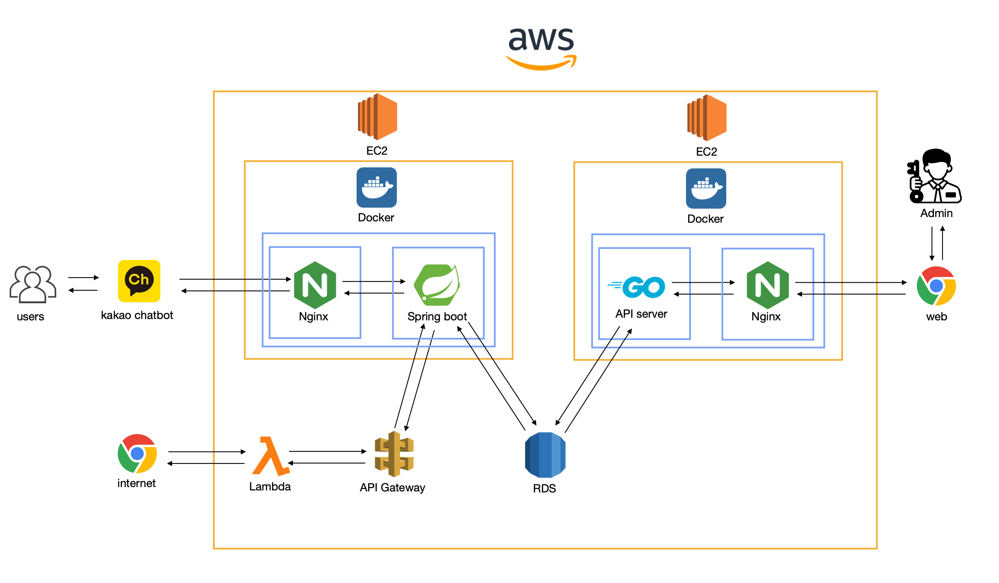
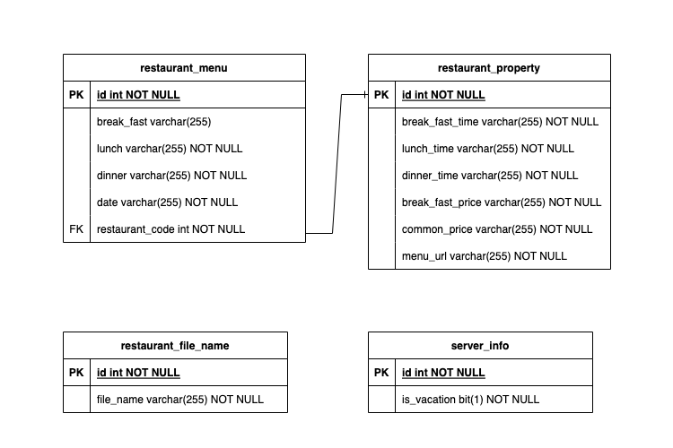

# 🍚 menuplanner-chatbot
한국공학대학교 TIP 지하 식당과 E동 식당의 메뉴를 알려주는 챗봇 프로젝트 먹도리

## Description
- 식당메뉴를 보기 위해 한국공학대 앱으로 들어가서 사진으로 봐야하는 불편함을 해결하기 위해서 제작했습니다.
- 카카오 챗봇을 이용해 메시지로 오늘의 E동 식당과 TIP 지하 식당의 메뉴를 제공합니다.

- [챗봇 바로 가기](https://pf.kakao.com/_hwWLb)

## Architecture



## Screenshot
<div>
  
  
</div>

## Tech Stack
```
TODO
```
## How it works?

1. spring 서버를 실행하면 API를 이용해 aws lambda에 올려 놓은 파이썬 함수에게 파일 이름을 파싱하라고 요청합니다.
2. 서버는 파일 이름을 받아서 다시 E동, TIP 식당의 메뉴들을 파싱하라고 요청합니다.
3. 서버는 메뉴들을 받아서 전부 RDS를 이용한 DB(mysql)에 저장합니다.
4. 카카오 챗봇으로부터 요청이 오면, 그에 맞는 메시지 형식을 json 형태로 반환합니다.
5. 식단 업데이트를 위해 매주 월요일 0시 0분마다 1 ~ 3 작업을 반복합니다.

## Run server

- aws lambda와 ec2가 필요합니다.
- 자세한 설명은 디렉토리의 README를 참조해주세요.

- [spring 서버](https://github.com/somewheregreeny/menuplanner-chatbot/tree/main/menuplanner-chatbot-api)
- [aws lambda python](https://github.com/somewheregreeny/menuplanner-chatbot/tree/main/aws-rambda-python)
